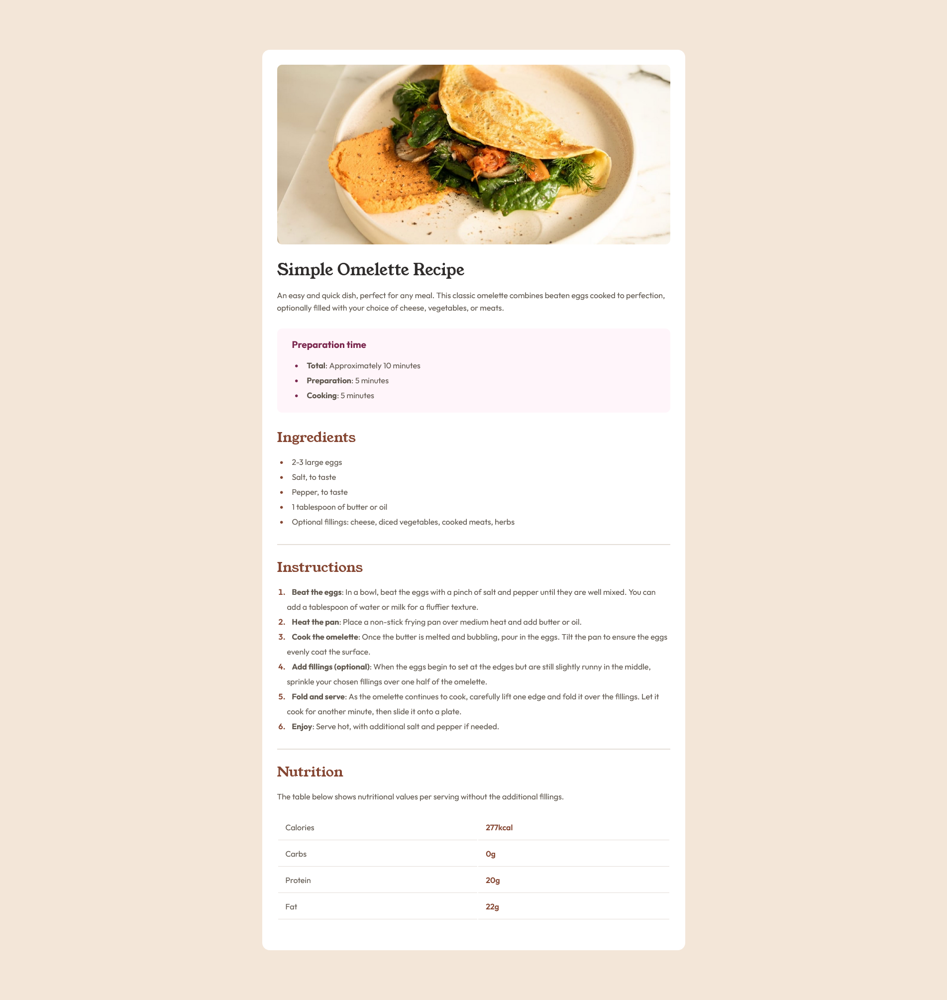

# Frontend Mentor - Recipe page solution

This is a solution to the [Recipe page challenge on Frontend Mentor](https://www.frontendmentor.io/challenges/recipe-page-KiTsR8QQKm). Frontend Mentor challenges help you improve your coding skills by building realistic projects.

## Table of contents

- [Frontend Mentor - Recipe page solution](#frontend-mentor---recipe-page-solution)
  - [Table of contents](#table-of-contents)
  - [Overview](#overview)
    - [Screenshot](#screenshot)
  - [My process](#my-process)
    - [Built with](#built-with)
    - [What I learned](#what-i-learned)
    - [Continued development](#continued-development)
    - [Useful resources](#useful-resources)
  - [Author](#author)
  - [Acknowledgments](#acknowledgments)

## Overview

### Screenshot



- Solution URL: [FEM Recipe Page Solution](https://github.com/Agbortoko/fem-recipe-page)
- Live Site URL: [FEM Recipe Page Live Preview](https://agbortoko.github.io/fem-recipe-page/)

## My process

### Built with

- Semantic HTML5 markup
- CSS for styling
- CSS custom properties
- Mobile-first workflow

### What I learned

I learned how to make use of the CSS custom properties which make it possible for me to easily reuse certain properties of my design. In the code snippet, i created custom properties for different colors of the design, and also created some custom properties for font-sizes in my design.

```css
    :root {
      --fs-base: 16px;
      --fs-1: 32px;
      --fs-2: 28px;
      --fs-3: 19px;

      --white: hsl(0, 0%, 100%);
      --stone100: hsl(30, 54%, 90%);
      --stone150: hsl(30, 18%, 87%);
      --stone600: hsl(30, 10%, 34%);
      --stone900: hsl(24, 5%, 18%);
      --brown800: hsl(14, 45%, 36%);
      --rose800: hsl(332, 51%, 32%);
      --rose50:hsl(330, 100%, 98%);
  }
```

I also learned how to make use of semantic HTML tags in my html structure, as seen below with the main and the section tags

```html
   <main>
      <section></section>
   </main>  
```

### Continued development

I need to understand more about the use of Media Queries in CSS.
I also need to understand more on how to import fonts locally after downloading using css

### Useful resources

- [W3Shools](https://www.w3schools.com) - This website asisted in implenting font import using the @font-face css asset.

## Author

- Website - [RabbitMaid](https://rabbitmaid.com)
- Frontend Mentor - [@Agbortoko](https://www.frontendmentor.io/profile/Agbortoko)

## Acknowledgments

I thank [Eschosys](https://eschosys.com) for showing me how to use Frontendmentor.
